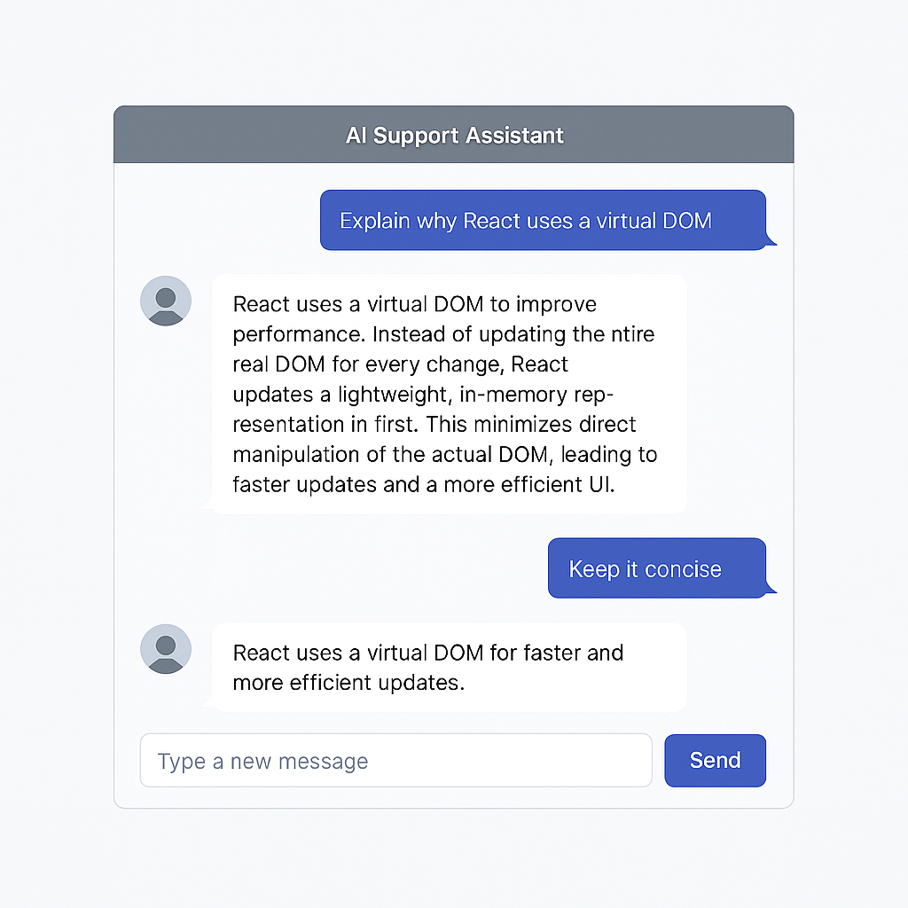

# 🤖 Next.js Gemini Chatbot

A lightweight AI-powered chatbot built using **Next.js (App Router)** and **Google Gemini AI**. Ask questions, get instant intelligent replies — all in a clean React interface.



---

## 🚀 Features

- ✨ Built with Next.js App Router
- ⚡ Real-time chat interface with streaming support
- 🤝 Google Gemini AI integration
- 📦 Clean architecture and API route handling
- 🛡️ .env support for secure API key usage

---

## 📦 Tech Stack

- **Framework:** [Next.js 14+](https://nextjs.org/)
- **Language:** TypeScript
- **LLM:** [Google Gemini API](https://ai.google.dev/)
- **UI:** React + Tailwind CSS (optional)
- **Hosting-ready:** Easily deployable to Vercel or any Node.js server

---

## 🛠️ Installation

```bash
git clone https://github.com/gags88/llm-chabot.git
cd nextjs-gemini-chatbot
npm install
